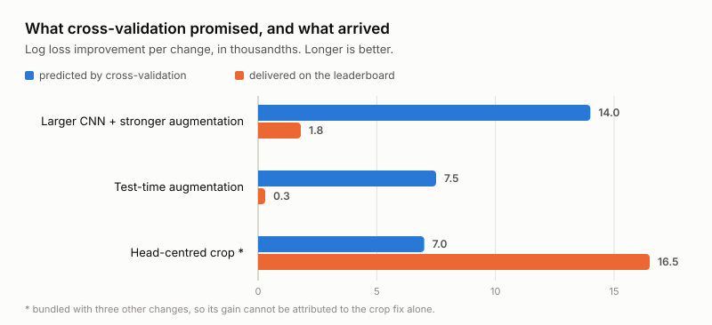
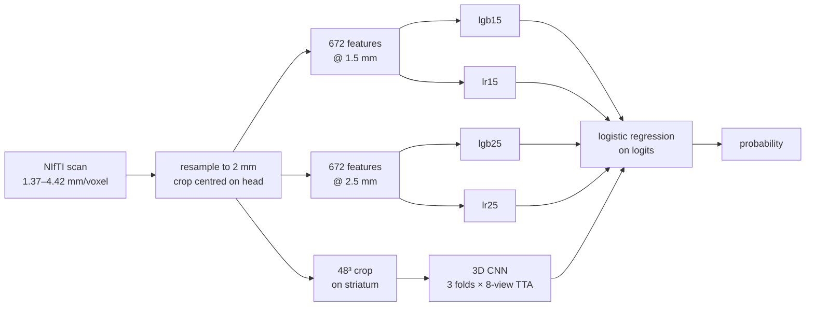

# DaT Parkinson's Challenge — 53rd of 378


Predict, from a 3D DaT SPECT brain scan, the probability that it is pathological rather
than normal. Run by [DrivenData](https://www.drivendata.org/competitions/311/dat-parkinsons-challenge/)
and scored by log loss, on 1362 training scans from 10 French hospitals.

| | |
|---|---|
| **Final rank** | **53 / 378** ranked participants (top 14%) |
| **Private log loss** | **0.3008** &nbsp;·&nbsp; AUROC 0.9410 |
| Best public | 0.2691, from 4 submissions |
| Winner / 3rd place (private) | 0.2532 / 0.2708 |
| Baseline (constant prediction) | 0.688 |
| Hardware | 8 CPU cores, ~100 h of compute, no GPU, no cloud |

Two constraints shaped everything here. Training ran entirely on CPU, which meant about
one experiment per night. And **not a single scan was ever opened** — see below — which
turned out to matter more than the missing GPU.

<picture>
  <source media="(prefers-color-scheme: dark)" srcset="docs/transfer-dark.svg">
  
</picture>

Three changes were measured on both sides. Two were refinements of a model that already
worked and delivered almost nothing; the one that contained a data-correctness fix
delivered more than it promised. That asymmetry is [finding #2](#2-refinements-transferred-at-10-a-correctness-fix-did-not),
and it is the thing I would most want to have known at the start.

**Contents** · [AI assistance](#on-ai-assistance) · [Key findings](#key-findings) ·
[Method](#method) · [Submissions](#submission-history) · [What worked](#what-worked) ·
[What didn't](#what-didnt) · [Measurement notes](#measurement-notes) ·
[Layout](#repository-layout) · [Running it](#running-it) · [Data policy](#data-and-weights)

---

## On AI assistance

The code here was written with the help of an AI assistant, and the competition rules
name AI chat tools explicitly among the third-party services that competition data must
not be sent to. Rather than decide case by case which file was safe to open, the
constraint was made structural: the whole pipeline was developed and debugged against
synthetic volumes, the real scans were never opened — by me or by any tool — and every
diagnostic in `research/` was written to answer its question with aggregates alone.
Group averages, distributions, log loss. That is why those scripts look the way they do.

It is also why finding #1 below took two months. The discipline was stricter than the
rule required, and it cost something real: no Colab, no rented GPU, and a defect that a
glance would have caught.

---

## Key findings

### 1. A data defect can hide behind a healthy-looking metric

For two months the preprocessing cropped its window at the **geometric centre of the
array**. That is fine when the field of view is tight around the head, and wrong when it
is not: one scanner group covers 629 mm per side, another 499 mm, and a head is about
200 mm, so it does not sit in the middle of half a metre of scan.

Measured on a sample, before and after the fix:

| scanner group | cases | signal retained | striatum against the window edge |
|---|---|---|---|
| A | 70 | 49.5% → **95.3%** | 100% → **0%** |
| B | 460 | 72.5% → **97.7%** | 60% → **0%** |
| C | 143 | 99.9% → 100% | 0% → 0% |

About **530 of 1362 patients** were getting a crop taken in the wrong place. Group B, the
largest in the dataset, had a log loss of 0.2387 — better than average. No metric ever
pointed at it.

The lesson is not "look at your data" but its corollary: **when you cannot look,
instrument.** Write the checks that report field of view, orientation and how much
signal survives each step, and write them in week one. A data defect does not only cost
its own margin, it silently corrupts every architecture decision made downstream of it,
and all of mine were made on top of this one.

*See [`research/check_crop_window.py`](research/check_crop_window.py).*

### 2. Refinements transferred at ~10%; a correctness fix did not

| change | measured (OOF) | on the leaderboard | transferred |
|---|---|---|---|
| larger CNN + stronger augmentation | −0.0140 | −0.0018 | 12% |
| test-time augmentation | −0.0075 | −0.0003 | 4% |
| head-centred crop *(bundled with 3 other changes)* | −0.0070 | −0.0165 | >100% |

One caveat stated up front: the third row is a bundle of four changes, so its gain
cannot be attributed to any single one. What *is* measured is that two changes which
**refined a working model** delivered 12% and 4% of what cross-validation promised,
while a bundle containing a **data-correctness fix** delivered more than it promised.

The proposed explanation — an explanation, not a measurement — is that internal
validation cannot see the benefit of reducing scanner dependence, because in random
cross-validation the same scanners always appear on both sides of the split. Consistent
with that, the out-of-fold-to-leaderboard gap narrowed from +0.036 to +0.026 with that
submission, and its grouped-fold score improved too. Three observations, one of them
bundled, do not make a rule.

Working heuristic for next time: if a change only lowers your cross-validated score,
discount it heavily; if it also narrows the gap between random-fold and grouped-fold
validation, take it more seriously.

### 3. Random cross-validation flatters a multi-centre dataset

Grouping by scanner signature (shape + spacing + orientation) gives 131 groups, the
three largest covering 59% of the data. Holding whole groups out:

| | random folds | grouped folds |
|---|---|---|
| linear branch, log loss | 0.3575 | **0.7560** |
| linear branch, AUROC | 0.9185 | 0.8185 |

On an unseen scanner the model still *ranks* patients reasonably, but its probabilities
fall apart — worse than predicting the base rate. Scanner metadata alone does not
predict the label (AUROC 0.53), so this is covariate shift in the features, not label
leakage. The competition test set evidently came from the same hospitals, or the
leaderboard score would have looked like the right-hand column.

*See [`research/scanner_groups.py`](research/scanner_groups.py).*

---

## Method



**1. Resample to a common physical grid.** Voxel sizes range from 1.37 to 4.42 mm across
the contributing hospitals, so raw arrays are not comparable. Every scan is resampled to
2 mm per voxel and cropped to a fixed 112³ cube centred on the head, located from the
centroid of a suprathreshold mask.

**2. Engineered features — 4 branches.** 672 features per scan at each of two scales,
built around what a nuclear medicine reader looks at: striatal binding ratio at several
thresholds, left-right asymmetry on all three axes, the shape of the suprathreshold
region (a healthy striatum is comma-shaped, a depleted one contracts to a dot), a
caudate-to-putamen intensity profile, and texture. Two LightGBM models and two
regularised linear models consume nested prefixes of that vector.

**3. A 3D CNN — 1 branch.** A 48³ crop at 2 mm centred on the striatum, min-max
normalised. Four convolutional blocks with residual connections, ~988k parameters,
global average **and** max pooling concatenated before the head. Augmentation: mirrors on
all three axes, ±12° rotations, ±10% scaling, intensity jitter. Three fold networks
averaged, each patient predicted over its 8 mirrored views.

**4. Stacking.** Logistic regression on the five branch logits, fitted on out-of-fold
predictions. Final weights: `cnnA 0.60 · lr25 0.22 · lgb15 0.14 · lgb25 0.09 · lr15 −0.11`.

Inference over the full test set takes about 5 minutes in the competition container.

Two choices worth noting. The CNN branch ships the **cross-validation fold networks**
rather than networks retrained on all the data: those are the networks that produced the
out-of-fold predictions, so the meta-model receives logits on the scale it was fitted on.
And the regularisation of the meta-model was chosen on grouped folds rather than random
ones, which halved the large opposing weights it otherwise placed on the two correlated
linear branches.

---

## Submission history

| date | change | internal OOF | public | private |
|---|---|---|---|---|
| 30 Aug | first submission — 5-branch stack | 0.2639 | 0.2877 | — |
| 7 Sep | larger CNN + stronger augmentation | 0.2499 | 0.2859 | — |
| 8 Sep | + test-time augmentation | 0.2499 | 0.2856 | — |
| 13 Sep | head-centred crop, features recomputed, fold networks, meta regularisation | 0.2429 | **0.2691** | **0.3008** |

Only the last submission's private score is visible, so per-change private effects
cannot be separated.

Internal progression from the start: constant prediction 0.688 → first CNN 0.566 →
clinical features 0.500 → physical resampling 0.367 → stacking 0.288 → 0.2429.

---

## What worked

| change | measured (OOF) |
|---|---|
| resampling from voxel spacing | −0.053 |
| features aligned to the striatum | −0.033 |
| larger CNN + stronger augmentation | −0.0140 |
| head-centred crop | see finding #2 |
| global max pooling alongside global average | −0.013 |
| averaging three seeds instead of one | −0.004 |

## What didn't

| idea | result |
|---|---|
| normalise the crop by brain background instead of min-max | CNN 0.2552 → 0.2739 |
| a second CNN on a different representation in the ensemble | +0.0007, not worth a second pipeline |
| non-linear meta-model (LightGBM over branch logits) | 0.289 → 0.302, overfits |
| a larger CNN (1.76M parameters) | 0.2528 → 0.2587, starts memorising |
| GroupNorm instead of BatchNorm | 0.3109 → 0.3399 |
| scanner metadata as a moderator in the meta-model | worse on both validation schemes |
| ImageNet-pretrained 2D branch on projections | worse; not included here |

The background-normalisation failure is the instructive one. Dividing by the brain
background hands the CNN the actual clinical quantity, which sounded strictly better. It
was not: min-max normalisation stretches each crop to full range and acts as automatic
contrast enhancement, which is what makes the *shape* legible — and the absolute ratio
was already measured by the feature branches. **In an ensemble the branches need
different jobs**; making one of them better at another one's job subtracts.

---

## Measurement notes

Things that cost real score, recorded so as not to repeat them.

**Measure a change in the configuration where it will be used.** Test-time augmentation
measured 0.016 on a single network. The submission already averaged three networks, and
seed averaging removes much of the same noise. On the leaderboard it was worth 0.0003.

**Do not bundle.** The final submission changed four things at once. It gained 0.0165 and
I cannot say which change earned it.

**Never select on out-of-fold predictions.** Picking the best validation epoch was
inflating every CNN result by 0.010 — larger than most of the differences being chased.
The fix is snapshot averaging: the mean of the last 15 epochs' predictions, no selection.

**The public leaderboard was not the leaderboard.** 0.2691 public, 0.3008 private — and
the reshuffle was general, not personal: the team leading the public board at 0.2154
does not appear in the private top three, which starts at 0.2532. With four submissions
there is no room to overfit a public split, so what this mostly measures is that the two
subsets were not equally hard, and that reading much into a public delta was a mistake
everyone could make.

**Where the loss lives.** 100 of 1362 cases carry half the total log loss, and the 246
cases the model is least sure about carry 44% of it. On the remaining 1262 it is already
near-perfect, so average-case improvements stopped paying long before the competition
ended.

---

## What I would do differently

**Ship a bracket of calibration temperatures.** The single biggest miss. Late in the
competition I tested scaling the final logits by a factor *s* and found the out-of-fold
optimum at exactly *s* = 1.0, concluded the model was already calibrated, and dropped the
idea. The right yardstick was not the out-of-fold set.
[Paul Bd's 6th-place write-up](https://github.com/paul-bd/DAT_challenge) measured the
optimal slope on three evaluation sets and found it falls monotonically as you move away
from the training distribution: 1.036 out-of-fold, ~0.85 on the public split, ~0.74 on
the private one. Their prescription — *never fix the slope at the in-distribution
optimum, ship a bracket* — is exactly the trap I walked into.

**Group the folds from day one.** Finding #3 was measured in the last week. Had the
architecture search been scored on grouped folds throughout, several of its conclusions
might have come out differently.

**Instrument the geometry before modelling anything.** Field of view, orientation, voxel
spacing, how much signal survives each preprocessing step. An hour in week one is worth
a hundred hours later.

---

## Repository layout

```
solution/    the 9 files executed by the competition container
research/    data preparation, training, diagnostics, evaluation
```

`solution/` is the submitted code, unchanged except for comments and a handful of
translated strings. Both were verified: the abstract syntax trees match with string
literals normalised, and running it against the submitted weights reproduces the
submitted predictions bit for bit.

`research/` scripts import the shared modules from `solution/`, so run them from the
repository root with that directory on the path:

```bash
PYTHONPATH=solution python research/check_crop_window.py 20
```

Worth reading first, in order:

| script | what it shows |
|---|---|
| [`check_orientation.py`](research/check_orientation.py) | what the dataset actually looks like, from headers alone |
| [`scanner_groups.py`](research/scanner_groups.py) | finding #3: random folds versus grouped folds |
| [`check_crop_window.py`](research/check_crop_window.py) | finding #1: how the crop defect was found and measured |
| [`compare_stack.py`](research/compare_stack.py) | like-for-like comparison of the last change |
| [`choose_meta_regularisation.py`](research/choose_meta_regularisation.py) | choosing regularisation on two validation schemes |
| [`train_cnn.py`](research/train_cnn.py) | snapshot averaging, and why the fold networks are kept |
| [`build_submission.py`](research/build_submission.py) | the checks that run before an archive is written |

Identifiers and some inline notes are in Italian, the language the project was written in.

## Running it

Neither the competition scans nor the trained weights are published, but the
preprocessing and feature path runs end to end on synthetic volumes. They are generated
rather than committed — incompressible random noise would be 41 MB against 150 KB of
code:

```bash
pip install -r requirements.txt
python research/make_synthetic_data.py          # 12 NIfTI volumes + a labels.csv
mkdir -p run/data && cp -r synthetic_data run/data/niftis
CODE_EXEC=$(pwd)/run DAT_DEBUG=1 python solution/main.py
```

`main.py` reads `data/niftis/*.nii.gz` under `CODE_EXEC` and writes `submission.csv`
there. It also expects the `finale_*` weight files beside itself, which are not
published, so this exercises preprocessing and feature extraction rather than the full
prediction path — predictions on random noise would be meaningless anyway. `DAT_DEBUG=1`
enables diagnostic output; in competition the run is silent.

## Data and weights

**Code, configuration and whole-dataset aggregate statistics only.**

No scans, no labels and no trained weights are published here. The competition prohibits
redistributing the data, and the weights are derived from it closely enough that I would
rather not test where the line falls. Publishing the code is explicitly permitted. The
organisers have said the dataset will be released as open data, so the pipeline can be
retrained from scratch.

The numbers quoted throughout — voxel spacings, fields of view, group sizes, how much
signal a crop retains — are aggregates over the whole dataset or over scanner groups.
Nothing describes an individual patient, and no voxel value or label is reproduced. The
same holds for every script in `research/`: they were written that way because the scans
were never opened in the first place.

## Licence

MIT — see [LICENSE](LICENSE).

---

**Jonathan Manca** · [LinkedIn](https://www.linkedin.com/in/jonathan-manca)

I built this to learn — how a medical image becomes a calibrated probability, and how to
tell whether a change to a model is real or only looks real. The competition supplied
what a tutorial cannot: a hidden test set, indifferent to how convincing the reasoning
behind a change happened to be. Most of what is written above I learned by getting it
wrong first, which is why the sections on what failed run longer than the one on what
worked.

If any of it saves someone a week, it was worth writing down.
